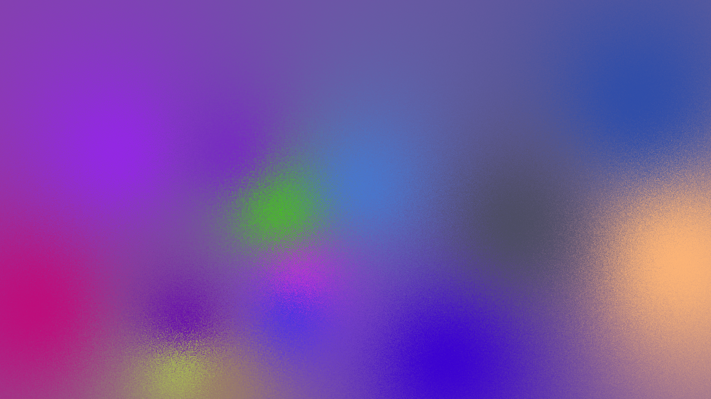

# noisycols

> Makes pretty images from noisy, colorful blobs.

The process is:
- Sample a few special points.  These will be the centers of the blobs.  (Currently: Uniform, independent.)
- Determine a random color for them.  (Currently: Uniform, independent.)
- Sample the colors at each pixel, which consists of:
  * Adding a bit of jitter.  (Currently: Gaussian, stddev 40.0)
  * Computing the distance to all color points.  (Currently: Euclidean.)
  * Compute a weight depending on the distance.  (Currently `d^-2`.)
  * Interpolate between the colors according to the computed weights, and convert to usable RGB.

This may take a moment, especially on large resolutions.  (30 seconds on my laptop.)

Here are a few especially pleasing ones:

## Table of Contents

- [Install](#install)
- [Usage](#usage)
- [Performance](#performance)
- [TODOs](#todos)
- [NOTDOs](#notdos)
- [Contribute](#contribute)

## Install

You need PIL (pillow) and Python >= 3.7.  Most developers already have those, so I don't supply a `requirements.txt`.

## Usage

Just use it!  No dependencies (beyond PIL), and it's short enough.

`./generate.py YOURFILENAMEHERE.png`

Personally, I like to invoke it like this: `./generate.py output_$(date +%s).png`.

If 30 seconds is too slow for you, try out lower resolutions.  Remember to adjust things like number of colorpoints!

## Performance

Bad.  It's unoptimized python.  I just share it because it's pretty pictures.

## TODOs

* Play around with it until I get bored.

## NOTDOs

* Anything professional

## Contribute

Feel free to dive in! [Open an issue](https://github.com/BenWiederhake/noisycols/issues/new) or submit PRs.
